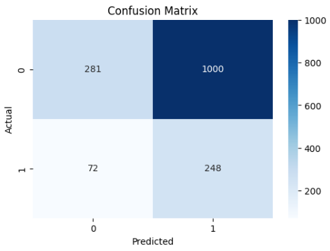

# Retail High-Value Customer Prediction 
<br>

## 🚀 Project Overview

This project applies machine learning techniques to identify customers with a high probability of generating future business value.

It represents the predictive evolution of my previous business intelligence project.

---
## 📊 Retail Sales Analysis Supermercados Pronta <br>
👉 (https://github.com/DiegoFCd/Pronta_Supermercados) 

While the original BI project focused on understanding historical sales patterns and customer behavior,
this project focuses on predicting which customers are most likely to become High-Value Customers in the future.

---
<br>

## 🎯 Business Objective

Companies often invest marketing and retention resources across their entire customer base without distinguishing those with the greatest potential for future revenue.

The goal of this project is to identify High-Value Customers proactively, enabling a more efficient allocation of marketing efforts, loyalty programs, and retention strategies.
---
<br>

## 📈 Project Objectives
- Analyze customer purchasing behavior
- Develop business-oriented functionalities
- Estimate future customer value
- Identify high-value customers
- Train and evaluate a machine learning model
- Translate model results into actionable business insights

---
<br>


## 📷 Analytics evolution diagram
```text
Retail Sales Analysis (BI)
↓
Customer Behavior Analysis
↓
Feature Engineering
↓
Future CLV Estimation
↓
High Value Customer Prediction
```
---
<br>

## 💡 Dataset

**This project uses customer-level retail transactional data.**

The original dataset contains:

- Customer ID
- Invoice information
- Product purchases
- Transaction dates
- Quantity purchased
- Revenue generated

During the Features Engineering phase, the dataset was transformed into a customer-centric analytical dataset, which includes:

- Recency
- Frequency
- Monetary value
- Average purchase time
- Average purchase interval
- Future customer lifetime value (future CLV)
  
**These characteristics were subsequently used to train the machine learning model responsible for identifying high-value customers.**

---
<br>

## 📷 Project Workflow

**🔧 Features Engineering**

Customer behavior variables were created from transaction history.

**Key features:**

- Average Ticket
- ​​Monetary Value
- Recency
- Average Purchase Interval

These variables summarize purchasing behavior and provide relevant information for predicting customer value.

---
<br>

## 🎯 Target Construction

Future customer lifetime value (future CLV) was calculated using future transactions.

Customers were classified as follows:

- 1 = High-value customer
- 0 = Regular customer

This transformation allowed the problem to be approached as a binary classification task.
--- 
<br>

## 🧠Model Used

**Random Forest Classifier**

The model was trained to identify customers most likely to become high-value customers.

Why RandomForest?

- Handles nonlinear relationships
- Works well with designed features
- Provides an interpretation of feature importance
- Robust against volatile sales behavior

---
<br>

## 📊 Model Performance

### Métricas de rendimiento

| Metric | Score |
|----------|----------|
| Precision (High Value) | 20% |
|Recall (High Value) | 78% |
| F1-Score | 32% |
|Threshold Optimization | 0.40 |

The classification threshold was adjusted to prioritize the detection of high-value customers.

This increased the accuracy to approximately 78%, allowing the model to identify the majority of prospective high-value customers, although accepting a higher number of false positives.
---
<br>

## 📷 Confusion Matrix



<br>

### 📊 Confusion Matrix Interpretation

After optimizing the threshold, the model correctly identified approximately **78% of potential high-value customers**.

The threshold was adjusted to prioritize customer recall, thus ensuring the acquisition of the majority of high-potential customers, even at the cost of generating additional false positives.

---
<br>

## 🔍 Feature Importance

The most influential variables for predicting future customer value were:

- Average Ticket
- ​​Monetary Value
- Recency
- Average Purchase Interval

These characteristics provide valuable information about the behavioral patterns associated with high-value customers.
---
<br>

## 💼 Business Value

This model can help organizations to:

- Prioritize high-potential customers
- Improve marketing segmentation
- Optimize loyalty campaigns
- Increase customer lifetime value
- Support data-driven decision-making

---
<br>

## 🛠 Technologies Used
- Python
- Pandas
- NumPy
- Scikit-Learn
- Random Forest
- Matplotlib
- Seaborn
- Google Colab

---
<br>

## 🔗 Related Project

 📊 Retail Sales Analysis Supermercados Pronta 👉 (https://github.com/DiegoFCd/Pronta_Supermercados)

This project expands on the original Business Intelligence analysis, moving from:

"What happened?" to "What is likely to happen next?"

Through predictive analytics and machine learning.
